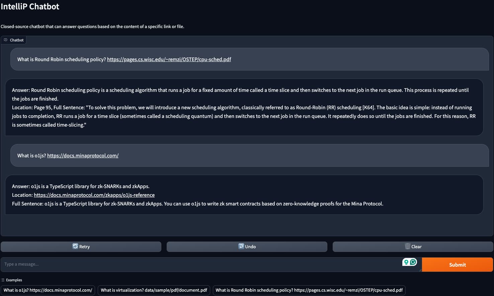

# IntelliP
### Try IntelliP at https://sanggyu314-intellip.hf.space

## What is IntelliP?
### IntelliP is a chatbot where you can provide your own websites or pdf documents and have a Q&A session with Solar LLM.

It uses the Upstage [Layout Analysis](https://www.upstage.ai/?utm_term=Document+AI&utm_content=%2Fgnb#layout%20analyzer) API to convert pdf documents into HTML files.

Then, it uses the Upstage [Embeddings](https://www.upstage.ai/?utm_term=Document+AI&utm_content=%2Fgnb#Embedding%20apis) API to create embeddings for each part of the HTML file, either scraped from the web or converted from the pdf documents.

The Q&A session answers are generated using Retrieval-Augmented Generation.

## Chat tips
### You can provide links at the end of a question.

Please note that we only accept pdf file links that and with `.pdf` at the moment.
Also, only `https://` endpoints are supported.

Once you provide a link to IntelliP, all the following conversations will use the same link to answer your questions.
Furthermore, the links are cached so it is faster the next time you provide the link.
However, this may be an issue if the website changes frequently.

## How to run
1. Install [pdm](https://pdm-project.org/en/latest/)
2. Provide [Upstage API](https://console.upstage.ai/) Key inside the `.env` file.
```
UPSTAGE_API_KEY=up_XXXXXXXXXXXXXXX
```
3. Run following script
```sh
pdm venv create
pdm sync
eval $(pdm venv activate in-project)
pdm run start
```
## Examples


## Alternatives
Google's [NotebookLM](https://notebooklm.google/) is providing a similar service.
